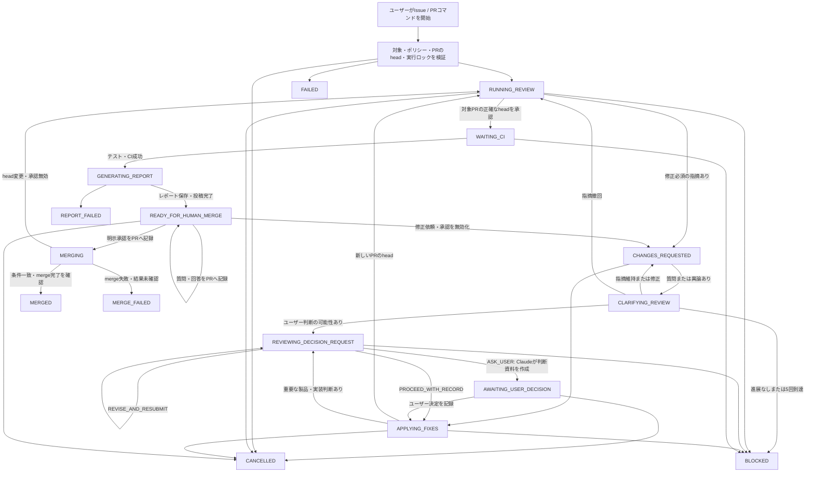

# Claude Code–Codex review loop: target experience

| Field | Value |
| --- | --- |
| Status | **In Review** |
| Parent roadmap | [#1](https://github.com/Mega-Gorilla/coding-review-agent-loop/issues/1) |
| Alignment issue | [#2](https://github.com/Mega-Gorilla/coding-review-agent-loop/issues/2) |
| Owner | Mega-Gorilla |
| Last updated | 2026-08-17 |
| Scope | Windows PowerShell 7、Linux/SSH上のPowerShell 7 |

## 1. この文書の目的

この文書は、Claude Codeをcoder、Codexをread-only reviewerとして利用し、PRの実装・修正・再レビュー、ユーザーの明示的なmerge承認、merge実行・確認までを支援するloopの完成イメージを定義する。

実装詳細を決める前に、ユーザーから見た操作、表示、停止条件、復旧、最終成果物を合意するためのゴールドキュメントとして使用する。

この文書が`Draft`または`In Review`の間、`Proposed`と`Open`は確定仕様ではない。Issue #2で合意した内容だけを`Decided`へ変更する。

## 2. 用語と合意状態

| Label | Meaning |
| --- | --- |
| `Decided` | ユーザーと合意済み |
| `Proposed` | 現時点の推奨案。レビューにより変更可能 |
| `Open` | ユーザー判断または技術検証が必要 |
| `Superseded` | 後の合意により置き換えられた過去の決定 |

主要な役割:

- **User**: 実行を開始し、必要な判断を行い、`READY_FOR_HUMAN_MERGE`で質問・修正依頼または明示的なmerge承認を入力する
- **Controller**: LLMを内包せず、GitHub、worktree、agent、test、CI、state、logと、明示承認後のmergeを決定論的に調整する
- **Claude Code host / coder**: 既存の対話型PowerShell sessionでSkillを実行し、会話contextを維持したまま実装・修正・test・commit・push・PR更新、判断事項と説明の作成、ユーザー入力の構造化を担当する
- **Codex reviewer**: 既存の対話sessionを再利用せず、各review turnをfreshなread-only subprocessとして実行し、現在のPR headとGitHub上の正式なconversationを評価する
- **Codex final reporter**: 承認済みheadの変更と検証履歴をread-onlyで説明する

## 3. 完成状態の要約

ここではtarget behaviorの合意とdelivery phaseを分けて示す。`Decided`となったbehaviorでも、MVPへ含める時期が`Proposed`または`Open`の場合がある。

### Decided

#### 起動・対象環境

- ユーザーがIssue番号またはPR番号を指定して明示的に開始する
- PR自動検知、常駐watcher、webhook、label triggerは使用しない
- 最初のreleaseにはPR modeとIssue modeの両方を含め、Issue指定からPR作成・review loop・merge完了まで利用可能にする
- Windows PowerShell 7とLinux/SSH上のPowerShell 7を対象とする
- 主操作は既存の対話型Claude Code PowerShell sessionからClaude Code Skillを自然言語またはslash commandで呼び出す
- Linux/SSHでは対応`tmux` wrapper内で開始したrunについて、SSH切断後もユーザー判断が不要な範囲を継続し、安全な判断gateまで到達できるようにする
- 既存の対話型Claude Code / Codex TUIへキー入力を注入しない

#### 役割・権限境界

- ControllerはLLMを内包しない決定論的なhelper / state machineとし、Skillから呼び出されてGitHub、state、process、test、CI、mergeを調整する
- Claude Codeは既存のactive sessionをhost / coderとして使用し、実装・修正・test・commit・push・PR更新とユーザー向け説明を担当する
- Codexは各review turnをfresh sessionで起動するreviewer / final reporterとしてread-onlyで動作し、code変更、commit、push、GitHubへの直接書き込みを行わない
- Codexへ必要なcontextはIssue、PR、diff、対象head、GitHub上のClaude / Codex / ユーザー発言から毎回再構築し、既存のCodex PowerShell sessionのmemoryへ依存しない
- GitHubへのagent発言はControllerだけが代理投稿し、agentの意味的な内容を変更しない
- ユーザーの明示承認がない無人auto-merge、deploy、本番操作は行わない

#### GitHub-backed conversation

- GitHub Issue / PRをClaude Code、Codex、ユーザーが共有する正式なconversation sourceとする
- 実装・review・clarification・ユーザー判断に関する各logical turnは、次agentを起動する前にGitHubへ投稿し、read-after-writeで確認する
- 未永続化の内部出力だけを次工程の根拠にせず、local memory、log、artifactはcacheまたは診断情報として扱う
- PR作成前はIssue、PR作成後はPRを正式なconversation sourceとし、両側のhandoff recordを確認してから切り替える
- Issue modeでは、指定Issueのタイトル・本文・採用対象コメントを実装要件として使用する
- Issueに対応するPRが既に存在する場合は、重複作成せず既存PRからPR modeへ合流する

#### Agent間の確認とユーザー判断

- 実装中に仕様上の判断が必要と思われる場合、Claudeが作成した問題定義・候補・意見をCodexがレビューし、ユーザー判断の要否も判定する
- ユーザー判断が必要な場合はClaudeがCodexの指摘を反映したdecision briefを作成して停止し、不要な場合はPRへ判断記録を残して継続する
- ClaudeはCodexの返答に疑問・異論・追加確認がある場合、同一topicについて最大5 clarification turnsまで再問い合わせできる
- clarificationの質問・回答とユーザー決定はGitHubへcanonical recordとして残し、意見相違や未解決事項を隠さない

#### 正常終了

- `READY_FOR_HUMAN_MERGE`は最終状態ではなく、final reportとGitHub conversationを確認したユーザーがClaude CodeのPowerShell画面で対話するgateとする
- ユーザーはgateで質問、修正依頼、cancel、または対象PRの明示的なmerge承認を入力できる
- 質問では回答をGitHubへ記録してgateを維持し、修正依頼ではreview loopへ戻る
- 明示的なmerge承認では、Controllerが承認済みhead、test、CI、未解決事項、mergeabilityを再検証してからmergeする
- 正常な最終状態はGitHub上のmerge完了を確認した`MERGED`とする

### Proposed MVP defaults

- 内部の実装順序はPR modeのGitHub transport・review loopを先に構築し、その上にIssue取得・実装・Issue→PR handoffを追加する
- 最初のreleaseはPR modeとIssue modeの両方の受入条件を満たしてから提供する
- 既存リポジトリのClaude Code Skill modeを主経路とし、`agent-loop` headless CLIは補助・復旧経路として維持する
- 対話型Claude Code terminalには現在state、次action、GitHub URLを簡潔に表示し、詳細と正式な会話履歴はGitHubで確認できるようにする
- Codexのfresh subprocess logは、必要に応じて別PowerShell tab / paneで観測できるようにする
- final reportは日本語で生成し、PRコメント、local artifact、terminal summaryへ出力する
- reviewとfixは最大3 roundを既定とする
- review承認後もCIがpendingなら`WAITING_CI`としてmerge可能扱いにしない
- ユーザー判断とmerge gateの操作は、既存の対話型Claude Code PowerShell sessionで受け取り、ControllerがGitHubへcanonical recordとして転記・確認してから進行する
- Codex reviewer / final reporterは現在headごとにfreshなread-only subprocessとして起動する
- `tmux`内のSSH runは切断後も自動処理を継続し、ユーザー判断時はGitHubへ資料を投稿して`AWAITING_USER_DECISION`、merge判断時はfinal reportを投稿して`READY_FOR_HUMAN_MERGE`で終了する
- `tmux`を利用できないSSH環境ではprocess生存を保証せず、GitHub checkpointからのresumeを保証する
- 既存のGitHub comment transport、public renderer、round metadata、resume、`discuss` transcriptを再利用し、Controllerの実装を最小化する

### Open

- final reportを常に日本語にするか、repository設定で言語を選択可能にするか
- CI待ちをcontrollerがforegroundで継続するか、一度終了してユーザーがresumeするか
- ユーザー判断・質問・修正依頼・merge承認を直接のGitHub commentで受け取り非同期resumeする機能を、どのreleaseへ含めるか
- repository既定のmerge methodを使うか、設定で`merge` / `squash` / `rebase`を選択可能にするか
- local artifactの既定保存期間とcleanup方法
- approved follow-upをfinal reportだけに表示するか、別Issueを自動作成するか
- Claudeのpermission要求を、明示停止後にどの経路で承認・再実行するか
- Claude Code Skillを任意の対象repositoryから利用可能にする配布方式を、repo-local Skill、user-level plugin / Skill、MCP併用のどれにするか

## 4. 完了の定義

ユーザーがコマンドを開始した後、次を満たした状態を完成とする。

1. Codexが現在のPR headをread-onlyでレビューしている
2. blocking findingがGitHubへCodexの発言として永続化され、そのcomment IDと対象head SHAを含めてClaude Codeへ渡されている
3. Claude Codeの修正、test、commit、push後に新しいheadが再レビューされている
4. 全reviewerが同一head・同一roundで承認している
5. 承認された正確なheadでfinal testと必要なGitHub CIが成功している
6. Codex final reporterが変更、test、review履歴、残存riskを説明している
7. workflowへ影響したClaude / Codexの各turnとユーザー決定がGitHub上で確認でき、未記録のturnが次工程の根拠になっていない
8. GitHub上の正式な会話記録と、cacheであるlocal artifactがapproved head SHAに結び付いている
9. controllerが`READY_FOR_HUMAN_MERGE`へ到達した時点ではmergeを実行せず、Claude Code画面のユーザー入力を待機している
10. gateで質問された場合はGitHubへ回答を記録して待機を継続し、修正依頼された場合は承認を無効化してreview loopへ戻る
11. ユーザーの明示的なmerge承認が、対象repository、PR番号、approved head SHA、入力経路とともにGitHubへ記録されている
12. ControllerがPR open状態、現在head、test、CI、未解決判断、mergeabilityを再検証し、承認対象と完全一致する場合だけmergeしている
13. GitHub上のmerge完了とmerged commit SHAを確認し、`MERGED`を表示している

## 5. MVP利用シナリオ

### 5.1 PR mode: 正常系

**Status: Proposed**

前提:

- ユーザーまたはClaude CodeがすでにPRを作成している
- 対象repository、`gh`、Claude Code、Codexの認証が完了している
- coder用とreviewer用のworktreeを準備できる

ユーザー操作（主経路: 既存のClaude Code PowerShell sessionへ入力）:

```text
/coding-review-agent-loop pr 512 --repo OWNER/REPO --reviewers codex
```

同じ内容を自然言語で指示してもよい。現在のactive Claude Code sessionを使用せずheadlessで起動・復旧する場合だけ、既存CLIの`agent-loop pr 512 --repo OWNER/REPO --reviewer codex`を補助経路として使用する。

期待する処理:

1. Controllerがrepository、PR、author、base/head、mergeability、lockを確認する
2. ControllerがPR conversation、review、review thread、agent metadataを取得し、未処理のユーザー発言と再開可能地点を確認する
3. Skill / Controller helperがCodex reviewer用checkoutを現在のPR headへ同期し、過去のCodex TUI memoryを引き継がないfresh sessionを起動する
4. CodexがIssue、PR、diff、対象headとGitHub上のcanonical conversationを入力としてread-onlyでreviewし、JSON Schemaに従うfindingを返す
5. Controllerが出力を検証・公開用にrenderし、Codex reviewとしてGitHubへ投稿する。投稿結果を再取得し、comment / review ID、URL、本文hash、対象head SHAの一致を確認する
6. findingがなければ、永続化されたreview承認を現在headへbindして承認後gateへ進む
7. blocking findingがあればClaude coder用checkoutを現在headへ同期し、GitHubへ永続化されたCodex commentと関連threadだけを正式なreview入力として渡す
8. Claude Codeがfindingを評価する。疑問・異論があれば質問をGitHubへ投稿・確認してからCodexへ渡し、D-011のclarification protocolを実行する
9. Claude Codeがfindingへ同意した場合は必要な修正とtestを行い、commit・pushする。Controllerが新head SHAを確認する
10. ControllerがClaudeの対応内容、finding disposition、test結果、新head SHAをGitHubへ投稿し、read-after-writeで確認する
11. 次のagentを起動する直前にGitHubの差分を再取得する。新しいユーザー発言があれば未処理のまま進まず、promptへ反映するかユーザー判断として停止する
12. Codexは新headとGitHub上のClaude responseに対して、前回sessionを再利用しないfresh read-only sessionで再レビューする
13. 最大roundまたは停止条件まで4～12を反復する
14. 承認されたheadでfinal local testとGitHub CIを確認する
15. Codex final reporterがGitHub上の正式な会話履歴とapproved headをread-onlyで確認し、最終レポートを生成する
16. Controllerがfinal reportをPRへ投稿・再取得し、local artifactとterminal summaryを生成する
17. Terminalへ`READY_FOR_HUMAN_MERGE`、PR URL、approved head、確認事項と選択可能な操作を表示し、既存のClaude Code PowerShell画面でユーザー入力を待つ
18. 質問の場合はClaudeが回答案を作成し、ControllerがPRへ記録・確認して同じgateを維持する。修正依頼の場合は既存承認を無効化し、`CHANGES_REQUESTED`からreview loopへ戻る
19. ユーザーが対象PRのmergeを明示的に承認した場合、Controllerが承認recordをPRへ投稿・確認し、PR open状態、現在head、test、CI、未解決事項、mergeabilityを再検証する
20. 検証対象が承認recordと完全一致する場合だけControllerがmergeを実行し、GitHub上のmerge完了とmerged commit SHAを再取得して`MERGED`を表示する

### 5.2 Issue mode

**Behavior / Delivery phase: Decided for the first release**

```text
/coding-review-agent-loop issue 436 --repo OWNER/REPO --reviewers codex
```

自然言語では「`OWNER/REPO`のIssue #436を計画・実装し、Codex reviewまで進めてください」のように指示できる。Skillは実装まで進むか、承認済みplanで停止するかをユーザー意図から確認する。

Issue modeでは、指定Issueのタイトル・本文・採用対象コメントを実装要件としてClaude Codeへ渡す。ここで指定する番号は実装対象のIssue番号であり、既存PR番号ではない。

PR modeとの差分:

1. ControllerがIssueのタイトル・本文・採用対象コメントを取得・filterし、IssueをPR作成前の正式なconversation sourceとする
2. Issueに対応する既存PRがあるか確認する
3. 既存PRがある場合は新しいPRを作らず、IssueへPR handoffを記録して、そのPRの現在headからPR modeへ合流する
4. 既存PRがない場合は、PR作成までのClaude / Codex間の計画、質問、review、判断記録をIssue commentとして投稿・確認する
5. Claude Codeが実装、test、branch、commit、push、PR作成を行う
6. Controllerが作成されたPR URLとhead SHAを取得し、Issueへhandoff comment、PRへorigin Issue commentを冪等に投稿する
7. handoffが両側で確認された後、正式なconversation sourceをIssueからPRへ切り替え、PR modeと同じreview loopへ合流する

PR作成後にagent応答またはvalidationが失敗しても、Issue実装を最初からやり直さず、発見済みPRから再開できることを必須とする。

### 5.3 GitHub-backed conversation invariant

**Status: Decided**

GitHub Issue / PRは、Claude Code、Codex、ユーザーが共有する正式な会話履歴である。local memory、session context、log、artifactはcacheまたは診断情報であり、GitHub上の正式記録を置き換えない。

1. Agentが論理的な発言を返したら、Controllerはschema検証、credential redaction、公開用renderを行う。
2. Controllerは発言者、run ID、round、finding / decision ID、clarification turn、対象head SHA、返信元comment IDを付けてIssue / PRへ投稿する。
3. Controllerは投稿結果をGitHubから再取得し、comment / review ID、URL、本文hash、対象head SHAを確認する。
4. 確認済みのGitHub recordだけを次agentのpromptへ含める。投稿前のmemory上の出力を直接次agentへ渡して進行しない。
5. 次agent起動直前に前回取得時点以降のGitHub発言を再取得する。新しいユーザー発言はagent発言より優先して反映し、要件変更または判断が必要なら停止する。
6. GitHub投稿またはread-after-write確認に失敗した場合は、次agentを起動せず安全なcheckpointで停止する。

投稿場所は次のとおりとする。

| Communication | Canonical GitHub location |
| --- | --- |
| PR作成前の計画・review・clarification | 対象Issueのconversation comment |
| PR全体へ関係するreview、対応summary、判断依頼 | PRのconversation commentまたはreview body |
| file / line固有のfinding | PR review thread |
| findingへのClaudeの質問・回答 | 元のreview threadへのreply。threadを作れない場合は元comment URL付きPR comment |
| PR作成後の実装・再review | 対象PR |
| ユーザー決定 | ユーザーのGitHub comment、またはControllerが入力経路を明記して転記したdecision record |
| merge gateでの質問・修正依頼・承認 | Controllerが入力経路、対象PR、対象head SHA、構造化したintentを明記して転記したPR comment |

1 logical turnは原則1 commentとし、tool logや逐次的な内部探索は投稿しない。chain-of-thought、credential、未redactの機密情報を本文やHTML commentへ含めてはならない。機械metadataは冪等性とresumeに必要な最小項目だけとし、HTML commentも公開情報として扱う。

### 5.4 Controller最小化と既存実装の再利用

**Status: Proposed implementation direction**

新しい会話databaseやLLM付きControllerを作らず、既存リポジトリのGitHub comment transport、public renderer、round metadata、resume処理、`discuss` modeの個別発言投稿を共通のGitHub conversation transportへ一般化する。

| Existing capability | Reuse | Required extension |
| --- | --- | --- |
| `SKILL.md` / `.claude/commands/coding-review-agent-loop.md` | active Claude Code sessionから自然言語またはslash commandで開始 | 任意の対象repositoryから利用できる配布・path解決方式を追加する |
| `helpers.skill_runner` | Codex subprocess、GitHub metadata、round stateを既存Skillから利用 | fresh reviewer、decision gate、明示承認後mergeを共通protocolへ追加する |
| `post_issue_comment` / `post_pr_comment` | Issue / PRへの代理投稿 | comment ID、URL、本文hashを返し、read-after-write確認を行う |
| `render_public_agent_comment` | agent / modelを明示した公開用render | decision request、clarification question / answerのkindを追加する |
| round metadata / resume | GitHub commentからroundを復元 | finding / decision / turn、返信元、head SHAをcanonical metadataにする |
| `discuss` mode transcript | 各participantの発言とsummaryを個別投稿 | Claude–CodexのPR clarificationへ一般化する |
| `get_pr_review_context` | PR conversationとhuman requirement取得 | review thread、増分cursor、投稿後検証を追加する |

Controller helperへ残す責務は、external CLI process起動・停止、worktree分離、schema検証、redaction、GitHub transport、idempotency、head binding、lock、turn / round上限、test / CI gate、明示承認の検証、merge実行・確認、cancel / resumeに限定する。Claude Code hostが会話・実装・説明を担当し、Controllerにはagent間の意味的な要約、推奨生成、独自message queue、会話専用local databaseを実装しない。

### 5.5 READY_FOR_HUMAN_MERGE interaction

**Status: Decided**

`READY_FOR_HUMAN_MERGE`は成功終了ではなく、既存の対話型Claude Code PowerShell sessionをユーザーとの接点にする待機gateである。ユーザー自身による入力は許可するが、Controllerがagent TUIへキー入力を注入してはならない。

Claudeは入力を次のintentへ構造化し、対象PRとhead SHAを添えてControllerへ渡す。Controllerはschemaを検証し、PRへcanonical recordとして投稿・再取得した後だけ遷移する。

| Intent | Meaning | Transition |
| --- | --- | --- |
| `QUESTION` | PR内容、risk、test、review履歴等への質問 | Claudeが回答を作成し、PRへ記録して`READY_FOR_HUMAN_MERGE`を維持 |
| `REQUEST_CHANGES` | 追加修正、要件変更、再検証の依頼 | 既存のreview承認とmerge承認を無効化し、`CHANGES_REQUESTED`へ戻る |
| `APPROVE_MERGE` | 対象PRと表示中headに対する明示的なmerge承認 | 承認recordを永続化して`MERGING`へ進む |
| `CANCEL` | 今回のrunを終了する指示 | mergeせず`CANCELLED`へ進む |

「問題なさそう」「OKです」など質問への同意ともmerge承認とも解釈できる入力は`APPROVE_MERGE`として扱わない。Claudeは対象PRをmergeしてよいかを明示的に確認し、曖昧さが解消するまでgateを維持する。

merge承認recordには少なくともrepository、PR番号、approved head SHA、構造化intent、ユーザー入力経路、記録時刻、GitHub comment IDを含める。Controllerは次をすべて満たす場合だけmergeを実行する。

- PRがopenであり、現在head SHAが承認対象と完全一致する
- Codex review承認、required local test、required GitHub CIが同じheadに対して有効である
- 未解決のblocking finding、decision request、review thread、変更依頼がない
- GitHubがmergeableと判定し、repository policyで許可されたmerge methodを使用できる

head変更、条件不一致、GitHub API失敗、merge結果未確認のいずれかが起きた場合は、別headを暗黙にmergeしない。承認を無効化するか`MERGE_FAILED`で停止し、差分と再開方法をユーザーへ提示する。

SSH切断等によりユーザーが対話できない場合、Controllerは`READY_FOR_HUMAN_MERGE`とfinal reportをPRへ投稿・確認し、mergeせずrunを終了する。GitHub commentを無期限に監視せず、ユーザーが再接続後にSkillをresumeして質問・修正依頼・明示承認を入力する。

### 5.6 SSH disconnect behavior

**Status: Decided**

Linux/SSHで対応`tmux` wrapper内から開始したrunは、SSH connectionが切断されてもClaude Code Skill、Controller helper、実行中のClaude / Codex subprocessを維持し、ユーザー入力が不要な処理を継続する。

- 仕様判断、permission、未解決の意見相違等でユーザー判断が必要になった場合、判断資料をIssue / PRへ投稿・read-after-write確認し、`AWAITING_USER_DECISION`をcheckpointして終了する
- review、test、CI、final reportまで完了した場合、PRへfinal reportと`READY_FOR_HUMAN_MERGE`を投稿・確認し、mergeせず終了する
- quota、credential、network、tool approval等で安全に継続できない場合、可能な範囲で理由とresume方法をGitHubへ記録し、`BLOCKED`または`FAILED`で終了する
- ユーザー回答をGitHubから無期限にpollして自動resumeしない。再接続後に同じSkill commandでresumeする
- `tmux`がない、wrapper外で開始した、またはprocess生存を確認できない場合、切断後の継続を保証しない。この場合も、最後に確認済みのGitHub checkpointから再開できるようにする
- MVPでは独自daemon、systemd service、複数hostを制御する常駐serviceを実装しない

## 6. 期待するterminal experience

### 6.1 通常表示

**Status: Proposed**

```text
Claude–Codex Development Loop
Repository : OWNER/REPO
PR         : #512 Improve process lifecycle handling
Base       : main @ 0123456
Head       : feature/process @ abcdef0
Round      : 2 / 3
State      : RUNNING_REVIEW

[12:10:03] PR and trust policy validated
[12:10:04] Fresh Codex reviewer started in read-only mode
[12:13:20] Review completed: 2 blocking findings
[12:13:21] Active Claude Code host started applying fixes
[12:19:48] Tests passed: 128 passed
[12:20:12] Pushed new head: fedcba9
[12:20:14] Starting fresh review for fedcba9

Skill state : GitHub AGENT_LOOP_META + local session cache
Codex log   : .agent-loop-logs/<run-id>-codex.log
```

対話型Claude Code terminalは、ユーザーとの会話・実装contextを維持しながら、agentの思考全文ではなく、判断に必要なstate、round、SHA、test、CI、次の処理を表示する。

### 6.2 監視pane

**Behavior: Decided / Wrapper implementation: Proposed**

正常時にagentごとのtab / paneを既定で自動起動しない。ユーザーがClaude Code画面から明示的に監視画面を要求した場合だけ、任意wrapperが主操作用のClaude Code PowerShellと、fresh Codex subprocessのlog監視用PowerShellを次のように配置する。

```text
+--------------------------------+-----------------------------+
| Claude Code host               | Codex reviewer log          |
| 対話・Skill・state・実装・承認 | fresh subprocessの進行・結果 |
+--------------------------------+-----------------------------+
```

wrapperを使用しなくてもreview loop本体は動作し、wrapperの起動失敗をrunの失敗にしない。同じrun IDの監視paneを重複作成しない。Linux/SSHでは同じ役割を`pwsh`と、必要に応じて`tmux` paneで提供する。Codex側paneは既存Codex TUIのsessionではなく、Skillが起動したfresh read-only subprocessのlogを観測する。ControllerによるTUIへのキー入力は行わず、ユーザー操作はClaude Code PowerShell画面へ入力する。

### 6.3 merge判断gateの表示

**Status: Proposed**

```text
READY_FOR_HUMAN_MERGE

PR            : https://github.com/OWNER/REPO/pull/512
Approved head : fedcba9876543210
Review rounds : 2
Local tests   : PASS (128 passed)
GitHub CI     : PASS (test, lint)
Final report  : PRへ投稿・localへ保存済み

選択できる操作:
1. PR内容について質問する
2. 修正または追加検証を依頼する
3. 「PR #512 のmergeを承認します」と明示する
4. 今回のrunをcancelする

現在はまだmergeされていません。曖昧な返答ではmergeしません。
```

### 6.4 merge完了表示

**Status: Proposed**

```text
MERGED

PR              : https://github.com/OWNER/REPO/pull/512
Approved head   : fedcba9876543210
Merged commit   : 1234567890abcdef
Merge method    : repository policy
Approval record : https://github.com/OWNER/REPO/pull/512#issuecomment-123
GitHub state    : MERGED（再取得して確認済み）
```

## 7. State model

### Decided states

| State | User meaning |
| --- | --- |
| `RUNNING_REVIEW` | Codexが現在headをreview中 |
| `CHANGES_REQUESTED` | blocking findingがあり、修正が必要 |
| `APPLYING_FIXES` | Claude Codeがfindingを評価・修正中 |
| `CLARIFYING_REVIEW` | 同一findingまたは判断依頼についてClaudeとCodexが追加確認中 |
| `REVIEWING_DECISION_REQUEST` | Claudeの判断依頼とユーザー判断の要否をCodexが評価中 |
| `AWAITING_USER_DECISION` | ClaudeがCodex reviewを反映した候補と推奨案を提示済みでユーザー判断待ち |
| `WAITING_CI` | review承認済みだが対象headのCI待ち |
| `GENERATING_REPORT` | final reporter実行中 |
| `READY_FOR_HUMAN_MERGE` | test・CI・reportが揃い、Claude Code画面で質問・修正依頼・明示的なmerge承認を待つ対話gate |
| `MERGING` | 明示的なmerge承認をGitHubへ記録済みで、Controllerが直前検証とmergeを実行中 |
| `MERGED` | GitHub上のmerge完了とmerged commit SHAを確認した正常な最終状態 |
| `MERGE_FAILED` | merge条件不一致、GitHub操作失敗、または結果未確認によりmerge完了を保証できない状態 |
| `BLOCKED` | 自動継続できないfinding、no-progress、外部依存待ち |
| `FAILED` | auth、network、schema、agent、GitHub操作等の失敗 |
| `CANCELLED` | ユーザーによる中断 |
| `REPORT_FAILED` | review承認は保持されているがreport生成に失敗 |



図を簡潔に保つため省略しているが、agentまたはユーザーの発言を伴うすべての遷移は、Section 5.3のGitHub永続化・read-after-write gateを通過する。gate未完了の状態遷移は成立しない。

## 8. User intervention

### Proposed intervention policy

| Situation | Automatic behavior | User receives | Resume |
| --- | --- | --- | --- |
| Codex finds blockers | Claudeが評価し、同意すれば修正、疑問があれば`CLARIFYING_REVIEW` | round summary | 不要 |
| Claude questions a Codex response | 同一topicで最大5 clarification turnsまでCodexへ再問い合わせ | 結論または停止理由のsummary | 通常は不要。未解決時のみ判断または追加検証 |
| Same finding remains | bounded retry後に停止 | unresolved findingとevidence | 同じPRから再開 |
| Max rounds reached | `BLOCKED` | 全未解決findingと推奨対応 | max rounds変更または手動修正後に再開 |
| Claude identifies a material decision | `REVIEWING_DECISION_REQUEST`でCodexが判断要否と提案内容を評価 | `ASK_USER`時のみ、Claudeが作成した判断理由、候補、影響、両者の見解、推奨案 | ユーザーの決定を記録してClaudeへ渡し、同じPRから再開 |
| Permission required | bypassしない | 必要な操作と理由 | ユーザー承認後に再開 |
| Quota exhausted | retry loopを止める | agent、reset情報、保存済みstate | quota回復後に再開 |
| Authentication failure | `FAILED` | 対象CLIと再認証手順 | 認証後に再開 |
| Network/GitHub transient failure | bounded retry | retry回数と最終error | 安全なcheckpointから再開 |
| GitHub conversation write / verification failure | 次agentを起動せず停止 | 未永続化turn、対象Issue / PR、retry結果 | 同じturnをidempotency key付きで再投稿・検証 |
| CI pending | `WAITING_CI` | check名、URL、head SHA | CI完了後に継続 |
| CI fails | 原因を分類 | failing checkとlog URL | code failureはClaude、infra failureは待機 |
| External head update | stopまたはreconcile | old/new SHAと無効化対象 | 新headでfresh review |
| READY gateで質問 | Claudeが回答案を作り、ControllerがPRへ記録 | 回答と根拠、参照したhead | `READY_FOR_HUMAN_MERGE`を維持 |
| READY gateで修正依頼 | review / merge承認を無効化して`CHANGES_REQUESTED` | 依頼のcanonical commentと影響範囲 | 同じPRのreview loopへ戻る |
| READY gateで明示的なmerge承認 | 承認をPRへ記録し、Controllerが直前検証後にmerge | 対象PR、approved head、検証結果、merge結果 | 成功時は`MERGED` |
| READY gateの入力が曖昧 | mergeせず明示確認する | 解釈できない点と必要な承認文脈 | 同じgateで再入力 |
| merge条件不一致・API失敗 | 別headをmergeせず停止 | 不一致、GitHub応答、承認の有効性 | fresh reviewまたは`MERGE_FAILED`から再開 |
| SSH切断（対応`tmux`内） | ユーザー入力不要な処理を安全gateまで継続 | GitHub上の進行記録、判断資料またはfinal report | 再接続後に同じSkill commandでresume |
| SSH切断中にユーザー判断が必要 | GitHubへdecision briefを投稿・確認して`AWAITING_USER_DECISION`で終了 | Issue / PR commentとresume方法 | 回答後に明示resume |
| SSH切断中にmerge-ready | final reportと`READY_FOR_HUMAN_MERGE`をPRへ投稿・確認して終了 | approved head、test、CI、risk。mergeは未実行 | 再接続後に質問・修正依頼・merge承認 |
| SSH切断（`tmux`外または継続不可） | process継続を保証しない | 最後に確認済みのGitHub checkpoint | 再接続後に同じSkill commandでresume |
| Ctrl+C | 子process treeを停止 | last checkpointとresume command | 同じPRから再開 |
| Reporter fails | `REPORT_FAILED` | review承認とreport error | reporterだけ再実行 |

### Decided: 実装中のユーザー判断フロー

要件だけでは実装方針を一意に決められず、選択によってユーザー体験、互換性、security、運用、scopeのいずれかが実質的に変わる場合は、agentが推測で決定しない。単純な内部実装の詳細や、安全かつ容易に戻せる選択まで毎回問い合わせる必要はない。

ControllerはLLMとして問題を解釈したり推奨を生成したりしない。意味的な提案はClaudeが作成し、その妥当性をCodexがreviewする。Controllerは構造化出力の検証、受け渡し、state遷移、記録、表示だけを行う。

1. Claude Codeは変更を止め、判断が必要と考えた理由、制約、候補、各候補の利点・欠点・影響、自身の推奨案をdraft decision requestとして構造化する。
2. Controllerは対象head SHAを固定し、source変更、commit、pushを進めず、stateを`REVIEWING_DECISION_REQUEST`にする。draftを対象Issue / PRへClaudeの発言として投稿し、read-after-writeで確認する。
3. CodexはGitHubへ永続化されたdraft comment、Issue、PR、diff、関連codeをread-onlyで確認し、ユーザー判断フローを開始する定義に該当するか、Claudeの問題定義・候補・意見が適切か、既存要件から自動決定できないかをreviewする。
4. ControllerはCodexのverdictを対象Issue / PRへCodexの発言として投稿・確認する。ClaudeはそのGitHub recordを受け取り、必要ならD-011に従って再問い合わせする。
5. `ASK_USER`の場合、ClaudeはCodexの指摘を省略せず反映した最終decision briefを作成する。Controllerがschemaと必須項目を検証し、GitHubへ投稿・確認してterminalにも同じ内容とURLを表示した後、`AWAITING_USER_DECISION`で停止する。
6. `PROCEED_WITH_RECORD`の場合、Claudeが根拠へ同意すれば、Codex verdictを参照したdecision recordをGitHubへ投稿・確認してから実装を継続する。Claudeがなおユーザー判断を必要と考える場合は、安全側に倒してユーザーへ問い合わせる。
7. `REVISE_AND_RESUBMIT`の場合、Claudeは問題定義または候補を修正し、GitHubへ新しいcommentとして投稿・確認してからCodexへ再提出する。同一topicの再提出はclarification turnとして数える。
8. ユーザーが候補を選択するか別案を指示したら、その回答をGitHub上のcanonical decision recordとして確定する。terminal等で受け取った場合は入力経路を明記してControllerが転記・確認し、そのGitHub recordを改変せずClaudeへ渡して実装を再開する。
9. 次のCodex reviewでは、通常のcode reviewに加えて、実装がGitHubへ記録されたユーザー決定へ適合していることを確認する。

Codexは次のいずれかを返す。

| Verdict | Meaning | Next action |
| --- | --- | --- |
| `ASK_USER` | 外部仕様、ユーザー体験、互換性、security、運用、scope等に実質的な選択が残る | Claudeが最終decision briefを作成して停止 |
| `PROCEED_WITH_RECORD` | Issue、PR、既存方針、明確な制約等から決定でき、ユーザー判断は不要 | ClaudeがPRへ根拠と採用実装を記録して継続 |
| `REVISE_AND_RESUBMIT` | 問題定義、影響調査、候補、根拠のいずれかが不足または不正確 | Claudeが修正し、Codexへ再提出 |

ユーザーへ提示するdecision briefは最低限、次を含む。

| Item | Content |
| --- | --- |
| Decision ID | 再開後も同じ判断を追跡できる一意なID |
| 判断が必要な内容 | 何を決める必要があり、なぜ今は自動決定できないか |
| 制約と影響範囲 | 要件、互換性、security、運用、変更対象 |
| 候補 | 各案の内容、利点、欠点、risk、見送った場合の影響 |
| Claudeの最終意見 | Codex reviewを反映したcoderとしての推奨案と根拠 |
| Codex review | 判断要否の判定、問題定義への修正、追加候補、risk、推奨案と根拠 |
| 意見の相違 | 両者が一致しない点を省略せず表示 |
| 推奨表示 | Claudeが最終的に推奨する候補と理由。`Recommended`を付け、Codexと異なる場合は明示 |
| 回答方法 | 番号付き候補を示し、推奨候補へ`Recommended`を付ける。自由記述も受け付ける |

表示例:

```text
AWAITING_USER_DECISION (decision-003)

判断が必要な内容: 設定ファイルがない場合の既定動作
影響: 既存利用者との互換性と初回実行時の安全性

[1] 現在の動作を維持する (Recommended)
    利点: 後方互換性を維持できる
    欠点: 初回設定の手間が残る
[2] 設定ファイルを自動生成する
    利点: 初回利用が簡単になる
    欠点: 意図しないfile書き込みが発生する

Claudeの当初意見: [2]。初回利用を簡単にできるため
Codex review: ASK_USER。[1]は暗黙のfile書き込みを避けられる
Claudeの最終意見: [1]。Codexの指摘を踏まえ、安全性と互換性を優先する
推奨: [1] (Recommended)

1または2を選択するか、別案を入力してください。
```

ユーザー回答を待つ間は、同じ判断に関係するsource変更、commit、pushを行わない。安全なcheckpoint保存、status表示、cancelは許可する。

`PROCEED_WITH_RECORD`で継続する場合、PRのdecision recordにはDecision ID、検討事項、Claudeの当初判断、Codexのverdictと根拠、採用実装、対象head SHAを残す。Controllerは同一runの記録を冪等に作成または更新し、PR commentの重複を避ける。

### Decided: Claude Code–Codex clarification protocol

このprotocolはユーザー判断フローだけでなく、通常のcode review、findingの意味・scope・根拠、修正案、誤検出の再評価等、ClaudeがCodexの返答へ疑問・異論・追加確認を持つすべての場面に適用する。

- 1 clarification turnは「ClaudeからCodexへの1回の質問または再提出」と「CodexからClaudeへの1回の回答」の一往復とする
- 最初のCodex reviewはturn数へ含めず、同一topicについて追加のclarification turnを最大5回まで許可する
- Claudeの質問とCodexの回答はそれぞれ対象Issue / PRへ投稿・確認し、両方のGitHub recordが揃った時点で1 turn完了とする
- counterはGitHub上の`run ID + finding / decision fingerprint + turn` metadataから再構築し、同じ問題のままhead SHAだけが変わってもリセットしない
- Claudeの質問には、対象finding、疑問点、根拠、期待する確認内容を含める。新しい根拠のない単なる否定や同一質問の反復は認めない
- file / line固有のfindingでは元のreview threadへreplyし、cross-cuttingな議論では返信元URLを含むconversation commentを使用する
- clarification中は対象headを固定し、source変更、commit、pushを行わない。codeを変更した場合はclarificationを終了し、新しいreview roundとして扱う
- review / fixの最大round数とclarification turn数は別々に管理する

Codexは通常reviewのclarificationへ次のいずれかを返す。

| Result | Meaning |
| --- | --- |
| `CONFIRMED` | 元のfindingまたは回答を維持する |
| `REVISED` | findingの問題定義、severity、scope、修正案等を変更する |
| `WITHDRAWN` | Claudeの説明または追加evidenceを受け、findingを撤回する |
| `MORE_EVIDENCE_REQUIRED` | 判断に必要な調査、test、再現条件等を明示する |
| `USER_DECISION_REQUIRED` | 技術的な正誤だけでは解決できず、D-010のユーザー判断フローへ移行する |

次の場合は5回を待たずにclarificationを終了する。

- Claudeがfindingまたは修正後の内容へ同意した
- Codexがfindingを撤回した
- ユーザー判断または外部情報・permissionが必要と判明した
- 実質的に同じ主張が2往復続き、新しいevidenceがないためno-progressと判定した
- IssueまたはPR要件自体の矛盾が判明した

5回で解決しない場合は一方のagentだけで進行を決定せず、`BLOCKED`へ移行する。製品・運用上の選択が残る場合はD-010へ接続し、純粋な技術検証が不足する場合は必要な追加test、再現手順、第三の検証方法をユーザーへ提示する。根拠なく技術的正誤をユーザーへ丸投げしない。

各turnの公開可能な質問、回答、evidence、resultはGitHubへ個別に記録し、それが正式なconversation sourceとなる。local artifactはGitHub comment ID、URL、本文hash、head SHAを持つcacheとする。GitHubには生の内部推論やtool logではなく、次agentまたはユーザーの判断へ必要な結論、根拠、質問、採用対応を記録する。

### Decided: merge承認gate

merge実行権限は、ユーザーの明示承認を条件としてControllerだけが持つ。Claudeは自然言語入力のintentを構造化し、必要なら明示確認を行うが、GitHub merge APIを直接呼び出さない。Codexは承認を創作・代行せず、必要に応じてread-onlyでriskや修正後headを再評価する。

承認後もControllerは承認recordの存在だけを根拠にせず、対象repository、PR番号、approved head SHA、review・test・CI・未解決事項・mergeabilityを直前に再取得する。GitHubのmerge応答がtimeoutした場合は再実行前にPR状態とmerged commit SHAを照会し、二重操作を避ける。

### Open intervention questions

- GitHub commentによる非同期のユーザー判断を将来サポートするか
- merge承認を固定commandで補助するか、明示確認付き自然言語だけにするか
- repository既定のmerge methodを使うか、設定で`merge` / `squash` / `rebase`を選べるようにするか
- permission承認をagent CLIへ直接渡すか、controller policy変更後にturnを再実行するか

## 9. Roles and permission boundary

### Decided

| Capability | User | Controller | Claude coder | Codex reviewer / reporter |
| --- | --- | --- | --- | --- |
| Start / cancel run | Yes | Handle | No | No |
| Read repository | Yes | Yes | Yes | Yes |
| Modify code | Optional | Coordination only | Yes | **No** |
| Run repository tests | Yes | Gate | Yes | Review only by default |
| Commit / push | Yes | Verify | Yes | **No** |
| Draft / review decision brief | Decide | Validate / route only | Draft | Review |
| Read canonical GitHub conversation | Yes | Fetch / verify | Through controller | Through controller |
| Post GitHub comments | Yes | **Exclusive agent proxy** | Through controller only | Through controller only |
| Approve PR merge | **Explicitly approve** | Validate / record | Interpret / request confirmation | **No** |
| Execute PR merge | Request through Claude Code | **Exclusive executor after approval** | **No** | **No** |
| Deploy / production operation | Outside workflow | **No** | **No** | **No** |

Reviewerのread-onlyはプロンプト上の依頼ではなく、sandbox、profile、worktree、credential、network、MCP、hookの能力制限で保証する。

Controllerは非LLMのstate machineとし、agentの意見や推奨を創作しない。Claude / Codexの構造化出力をschema検証し、欠落があれば再実行または停止する。

Claude / CodexへGitHub書込credentialを渡さず、Controllerだけが代理投稿する。Controllerはagentの意味的な内容を変更せず、発言者とmodelを明示して公開用にrenderする。agent間の次turnは投稿済みGitHub recordを入力とし、未投稿の内部出力を直接受け渡さない。

### Proposed safety behavior

- reviewerへpush可能なGitHub credentialを渡さない
- GitHub discussionはcontrollerが取得・filterしてreviewerへ渡す
- reviewer sessionをhead SHAへbindし、head変更時にfresh sessionにする
- `CLAUDE.md`、`AGENTS.md`、`.claude/**`、`.codex/**`、`.github/workflows/**`の変更を目立つ形で表示する
- fork PRまたは信頼されていないauthorでは、agent instructions、hooks、workflow、testの実行を既定拒否する
- prompt、log、artifact、PR commentからcredentialをredactする
- dangerous permission bypass、無人auto-merge、GitHub auto-merge予約をpresetから利用できないようにする
- merge承認をrepository、PR、approved head SHAへbindし、head変更時に失効させる
- 曖昧な肯定、過去の承認、別PRへの承認から`APPROVE_MERGE`を推論しない

## 10. Failure, cancellation, and resume experience

### 10.1 保存するcheckpoint

**Status: Proposed**

各重要stepで次を保存する。

- run ID、repository、Issue / PR番号
- base SHA、observed head SHA、approved head SHA
- state、round、agent role、session ID
- finding ledgerとresolution
- GitHub conversation cursor、comment / review / thread ID、URL、返信元ID、本文hash、投稿者role、対象head SHA
- clarification counter、finding / decision fingerprint、GitHubへ永続化された質問・回答・evidence・result
- coder実行前後のHEAD、dirty status、push後head
- test command、cwd、result、duration
- GitHub check名、result、URL
- artifactとlogへのpath
- 最後に成功したGitHub mutation、idempotency marker、read-after-write確認結果
- error category、再開可能地点、推奨resume command
- 未解決decision request、Claude / Codexの意見、ユーザー回答、回答時のhead SHA
- merge gate intent、承認対象PR、approved head SHA、入力経路、approval comment ID
- merge method、merge API結果、merged commit SHA、GitHub上の再確認結果

### 10.2 Cancel

**Status: Proposed**

- Ctrl+Cを1回受けたらgraceful cancellationを開始する
- 新しいagent processを起動しない
- 実行中の子process treeをOSごとの方法で停止する
- 最後のcheckpointを保存する
- `CANCELLED`、停止したprocess、resume commandを表示する
- 2回目のCtrl+Cは緊急強制停止として扱う案を技術検証する

### 10.3 Resume

**Status: Proposed**

ユーザーは同じClaude Code Skill commandをactive sessionまたは新しいClaude Code sessionで再実行するだけで、安全なcheckpointから再開できる。

```text
/coding-review-agent-loop pr 512 --repo OWNER/REPO --reviewers codex
```

headless fallbackでは`agent-loop pr 512 --repo OWNER/REPO --reviewer codex`を使用できる。Controller helperは最初にGitHub conversationからcanonical stateを再構築し、local checkpointはcacheとして照合する。GitHub上の現在headと保存済みheadを比較し、古いagent session、未確認の投稿、承認を無条件に再利用しない。質問だけ投稿済みで回答がない等のpartial turnは同じturn IDから再開する。

### 10.4 GitHub conversation failure

**Status: Decided**

- 投稿がtimeoutした場合は成功・失敗を推測せず、idempotency markerでGitHubを検索してから再投稿する
- 投稿後のcomment / review ID、URL、本文hash、対象head SHAを取得できるまで、そのturnをcompletedにしない
- GitHub APIのrate limitまたは一時障害では、serverのretry情報に従ってbounded retryし、上限後は次agentを起動せず`FAILED`とする
- 質問だけが投稿済みで回答がないpartial clarification turnは、質問を重複投稿せず同じcomment IDへの回答から再開する
- canonical commentが削除・改変されmetadataまたはbody hashが一致しない場合は、silent repairせず`BLOCKED`として差分をユーザーへ提示する
- local cacheだけに存在しGitHubへ確認できないagent出力は破棄し、workflowの判断根拠に使用しない

### 10.5 Merge failure

**Status: Decided behavior / implementation detail: Proposed**

- merge直前にheadが変わっていた場合は承認を失効させ、変更後headをmergeせずfresh reviewへ戻す
- required check、未解決thread、mergeability等が変化した場合はmergeせず、差分を`MERGE_FAILED`として提示する
- merge APIがtimeoutまたは不明な結果を返した場合は、同じ操作を再送する前にGitHubからPR stateとmerged commit SHAを再取得する
- GitHub上でmerge完了を確認できた場合だけ`MERGED`へ遷移する。確認できない場合は成功と表示しない
- retryまたはresumeでも承認対象と異なるheadをmergeせず、新しい明示承認を要求する

### 10.6 SSH disconnect and detached execution

**Status: Decided behavior / wrapper implementation: Proposed**

- Linux/SSHのpreflightで`tmux`の有無、現在session、永続workdir、GitHub / agent credentialを確認する
- 対応wrapperはrepository、Issue / PR、run IDへbindした`tmux` sessionを作成または再接続し、同じrunの重複起動を防ぐ
- `tmux`内ではSSH切断をcancelとして扱わず、ユーザー判断が不要な現在のworkflowを継続する
- ユーザー判断またはmerge判断へ到達したらGitHubへcanonical recordを投稿・確認し、processを無期限待機させず安全にrunを終了する
- `tmux`外ではprocess生存を保証せず、突然終了後には新しいGitHub commentを保証しない。最後に確認済みのGitHub recordから再開する
- wrapperが利用できない、permission promptを非対話で解決できない、または安全な継続を保証できない場合は、bypassせず中断・resumeを選ぶ

## 11. Final report experience

### Proposed outputs

1. **PR comment**: ユーザーがGitHub上で読む正式なsummary
2. **Local JSON artifact**: GitHub上の正式記録を参照するschema検証済みcache / derived artifact
3. **Local Markdown artifact**: JSONから決定論的にrenderした複製
4. **Terminal summary**: merge判断に必要な短い結果とlink。merge後はGitHubで確認した結果を追記

### Proposed report language

- 既定は日本語
- file path、command、state、SHA、固有名詞は原文を維持
- repository設定による言語切り替えはOpen question

### Proposed report example

```markdown
## READY_FOR_HUMAN_MERGE

### Summary

PR #512は、WindowsとLinuxでagent processを安全に停止できるplatform abstractionを追加します。既存のPOSIX動作を維持し、Windowsでは子process treeがtimeoutやCtrl+C後に残らないようにします。

### Why

従来のrunnerはPOSIXのprocess groupに依存し、Windowsネイティブでtimeoutとcancelを安全に処理できませんでした。

### User-visible changes

- PowerShell 7から同じCLIを実行できます
- Ctrl+C時にClaude / Codexの子processが停止します
- timeout時にresume可能な状態と原因を表示します

### Acceptance criteria

| Criterion | Result | Evidence |
| --- | --- | --- |
| Linux existing behavior | Pass | `pytest ...` |
| Windows child cleanup | Pass | Windows CI `process-tests` |
| Ctrl+C recovery | Pass | test and run log |

### Review history

- Round 1: Codex found that grandchildren survived forced timeout
- Commit `fedcba9`: Claude assigned the process tree to a Windows Job Object
- Round 2: Codex approved the exact head

### Validation

- Approved head: `fedcba9876543210`
- Local tests: 128 passed
- GitHub CI: `test` and `lint` passed

### Remaining risks and follow-ups

- Windows Store版PowerShellは未検証です
- SSH切断後の継続は対応`tmux` wrapper内で保証し、wrapper外ではGitHub checkpointからresumeします

### merge前の確認

1. PR headが`fedcba9876543210`のままであること
2. Windows runner結果を確認すること
3. Remaining risksを許容できること

この時点ではまだmergeされていません。Claude Code画面で質問・修正依頼・対象PRの明示的なmerge承認を入力できます。
```

明示承認後のmergeが成功した場合、Controllerは同じPRへ次の決定論的な完了recordを追記する。

```markdown
## MERGED

- PR: #512
- Approved head: `fedcba9876543210`
- Merged commit: `1234567890abcdef`
- Merge method: repository policy
- User approval: canonical comment link
- GitHub verification: PR state `MERGED`
```

## 12. Windows and Linux/SSH experience

### Decided common behavior

- ユーザーはPowerShell 7から同じpreset CLIを実行する
- state名、report schema、GitHub comment形式をOS間で共通化する
- controllerは対象repositoryと同じマシンで実行する
- timeout、cancel、resumeを両OSで提供する
- Linux/SSHでは対応`tmux` wrapperをMVPの切断耐性として提供し、ユーザー判断またはmerge判断までの安全な自動処理を継続できるようにする

### Platform differences

**SSH / `tmux` disconnect behavior: Decided. Remaining implementation details: Proposed.**

| Area | Windows | Linux/SSH |
| --- | --- | --- |
| Shell | PowerShell 7 | PowerShell 7 (`pwsh`) |
| Monitoring | Windows Terminal tab / pane | shellまたは`tmux` pane |
| Process tree | Windows Job Object等 | POSIX process group |
| Temp paths | `%TEMP%`, `%LOCALAPPDATA%` | `/tmp`, XDG/cache directory |
| Long-running session | terminalを維持 | 対応`tmux` wrapper内は切断後も継続。wrapper外はGitHub checkpointからresume |

### Open platform questions

- Windows Store版とMSI版PowerShellの両方を正式検証するか

## 13. MVP boundary

### MVP inclusions

**PR mode / Issue mode and SSH / `tmux` resilience: Decided. Other implementation details: Proposed.**

- 手動起動のPR mode
- 手動起動のIssue modeと、Issue要件取得・既存PR再利用・Issue→PR canonical handoff
- 既存の対話型Claude Code PowerShell sessionから呼び出すClaude Code Skill modeを主経路とする
- active Claude host / coderと、fresh read-only Codex reviewerの固定preset
- `agent-loop` headless CLIを補助・復旧経路として維持する
- reviewer read-only保証
- review -> fix -> re-review、最大round
- head SHA binding、coder snapshot、PR lock
- local test gate、GitHub CI確認
- Windows/Linux process abstraction
- cancel、timeout、resume
- 明示要求時だけ起動する任意のWindows Terminal / `tmux`監視wrapper
- Linux/SSH用の対応`tmux`継続wrapper、disconnect preflight、重複run防止、安全gateでのGitHub投稿・終了、reconnect / resume
- final reporter、`READY_FOR_HUMAN_MERGE`対話gate、明示承認後のgated merge、`MERGED`確認
- PR comment、local artifact、terminal summary
- ユーザー判断フローと最大5 clarification turnsの共通対話規約
- GitHubを正式なconversation sourceとする投稿・read-after-write・resume transport
- credential redactionと基本trust policy

### Proposed later phases

- llm-custom-commands compatibility wrapper
- 複数reviewer
- distributed multi-host lock
- GitHub commentを直接監視して再開する非同期ユーザー判断
- notification integration
- advanced finding fingerprintとtrend分析

### Decided exclusions

- PR自動検知、watcher、webhook、label trigger
- 対話型agent TUIへのキー入力注入
- 既存のCodex対話sessionをautomation reviewerとして再利用すること
- 明示承認のない無人auto-merge、GitHub auto-merge予約、曖昧な入力によるmerge
- deploy、本番操作
- Windowsから複数SSH先を中央制御するremote execution system
- 独自daemon、systemd service、常駐型の中央orchestrator

## 14. Open questions

Issue #2で次を順に確認する。

| ID | Question | Why it matters | Current recommendation |
| --- | --- | --- | --- |
| Q-003 | final reportの既定言語は日本語固定か | schema、template、設定項目へ影響 | 日本語既定、将来選択可能 |
| Q-004 | CI pending時にforegroundで待ち続けるか | terminal占有とresume UXへ影響 | bounded wait後に`WAITING_CI` |
| Q-005 | ユーザー判断・merge gateの入力をどの経路で受け取るか | terminal継続、resume、GitHub comment監視の実装方式へ影響 | MVPは既存の対話型Claude Code PowerShell画面で受け取り、ControllerがGitHubへcanonical recordとして転記・確認。直接の非同期GitHub入力は後続phase（D-013） |
| Q-008 | artifactの保存期間はどの程度か | disk、機密情報、監査要件へ影響 | repo単位設定、既定30日を検討 |
| Q-009 | approved follow-upをどう表示するか | merge判断と追加Issue作成へ影響 | reportでsummary、Issue自動作成なし |
| Q-010 | Claude permission要求をどう扱うか | bypassせず自動化する境界を決める | 停止して明示的にユーザーへ提示 |
| Q-011 | どのmerge methodを使用するか | repository履歴、branch protection、commit構成へ影響 | repository既定を尊重し、必要なら明示設定 |
| Q-012 | Claude Code Skillを任意repositoryへどう配布するか | 現行はrepo rootまたは`helpers/`・`SKILL.md`配置が必要で、複数repository運用の導入負荷へ影響 | user-level plugin / Skillを第一候補とし、MCPは決定論的Controller toolの公開が必要になった段階で検討 |

## 15. Decision log

| ID | Date | Decision | Status | Source |
| --- | --- | --- | --- | --- |
| D-001 | 2026-08-17 | 実行はユーザーがIssue / PR commandで開始する | Decided | Issue #1 discussion |
| D-002 | 2026-08-17 | PR自動検知、watcher、webhook、label triggerは対象外 | Decided | Issue #1 discussion |
| D-003 | 2026-08-17 | Controllerは対話型TUIへキー入力を注入せず、agent turnを非対話CLIとして起動する | Superseded by D-014 / D-015: Claudeはactive Skill host、Codexだけをfresh subprocess化。キー注入禁止は維持 | Issue #1 roadmap、PR #3 discussion |
| D-004 | 2026-08-17 | PowerShellからの操作・log監視を維持する | Decided | Issue #1 roadmap |
| D-005 | 2026-08-17 | 明示承認のない無人auto-merge、deploy、本番操作は行わない | Decided | Issue #1 roadmap、PR #3 discussion |
| D-006 | 2026-08-17 | 正常なterminal stateは`READY_FOR_HUMAN_MERGE` | Superseded by D-013 | Issue #1 roadmap |
| D-007 | 2026-08-17 | Issue #1を親roadmap、Issue #2を完成イメージ合意に使う | Decided | Issue #2 |
| D-008 | 2026-08-17 | 既存docsは初回整理で移動せず、indexで分類する | Decided | Issue #2 preparation |
| D-009 | 2026-08-17 | Issue modeは指定Issueの内容を実装要件とし、対応PRが既にあれば重複作成せず再利用する | Decided | PR #3 discussion |
| D-010 | 2026-08-17 | Claudeのdraft decision requestをCodexが判断要否も含めてreviewし、`ASK_USER`時はClaudeが最終briefを作成して停止、`PROCEED_WITH_RECORD`時はPRへ記録して継続する | Decided | PR #3 discussion |
| D-011 | 2026-08-17 | ClaudeはCodexの返答へ同一topicあたり最大5 clarification turnsまで再問い合わせでき、解決・no-progress・ユーザー判断移行時は早期終了する | Decided | PR #3 discussion |
| D-012 | 2026-08-17 | GitHub Issue / PRをagent・ユーザー間の正式なconversation sourceとし、各論理turnを投稿・read-after-write確認してから次agentを起動する | Decided | PR #3 discussion |
| D-013 | 2026-08-17 | `READY_FOR_HUMAN_MERGE`をClaude Code PowerShell画面で質問・修正依頼・明示承認を受ける対話gateとし、明示承認をGitHubへ記録後、Controllerが同一headを再検証・merge・確認して`MERGED`を正常な最終状態とする | Decided | PR #3 discussion |
| D-014 | 2026-08-17 | 主操作は既存の対話型Claude Code PowerShell sessionからClaude Code Skillを呼び出し、active sessionの会話contextを維持したままClaudeがhost / coderを担当する。`agent-loop` CLIはheadless・復旧用の補助経路とする | Decided | PR #3 discussion |
| D-015 | 2026-08-17 | Codex reviewer / final reporterは既存の対話sessionを再利用せず、現在headとGitHub canonical conversationを入力に毎回freshなread-only subprocessとして実行する | Decided | PR #3 discussion |
| D-016 | 2026-08-17 | 最初のreleaseへPR modeとIssue modeの両方を含める。内部実装はPR modeを先行可能だが、Issue取得・実装・既存PR再利用・Issue→PR handoff・共通review loopまで完成する前に初回releaseとしない | Decided | PR #3 discussion |
| D-017 | 2026-08-17 | agentごとのtab / paneは既定で自動起動せず、ユーザーがClaude Code画面から明示要求した場合だけ任意wrapperで監視paneを開く。wrapperなしでもcore loopは動作し、Codex paneはfresh subprocessのread-only log監視に限定する | Decided | PR #3 discussion |
| D-018 | 2026-08-17 | Linux/SSHでは対応`tmux` wrapper内のrunをSSH切断後もユーザー判断不要な範囲で継続する。判断が必要ならGitHubへ資料を投稿して`AWAITING_USER_DECISION`、merge-readyならfinal reportを投稿して`READY_FOR_HUMAN_MERGE`でmergeせず終了する。wrapper外はprocess生存を保証せずGitHub checkpointからresumeし、独自daemonはMVP外とする | Decided | PR #3 discussion |

## 16. Agreement checklist

- [ ] Section 3の完成状態を確認した
- [ ] PR modeの正常系シナリオを確認した
- [ ] terminal表示と監視paneを確認した
- [ ] state modelを確認した
- [ ] user interventionとresume UXを確認した
- [ ] 実装中のユーザー判断フローとdecision briefを確認した
- [ ] Claude Code–Codex clarification protocolと5 turn上限を確認した
- [ ] GitHub-backed conversation、投稿gate、Issue→PR handoffを確認した
- [ ] Controllerの最小責務と既存GitHub transport再利用方針を確認した
- [ ] Claude Code Skillを主経路とし、active Claude contextとfresh Codex reviewerを組み合わせる方針を確認した
- [ ] `READY_FOR_HUMAN_MERGE`での質問・修正依頼・明示承認と、`MERGED`までの遷移を確認した
- [ ] merge承認のhead binding、直前検証、失敗時の安全動作を確認した
- [ ] roleとpermission boundaryを確認した
- [ ] final reportの形式とサンプルを確認した
- [ ] Windows / Linux SSHの差異を確認した
- [ ] MVP inclusions、later phases、exclusionsを確認した
- [ ] Q-001・Q-002はD-016、Q-007はD-017、Q-006はD-018で解決済みであり、残るQ-003～Q-005・Q-008～Q-012を解決または判断時期付きで保留した
- [ ] 文書statusを`Agreed`へ変更した
- [ ] implementation plan作成へ進むことをIssue #2で確認した

## 17. Agreement後のnext action

1. `docs/plans/implementation-plan.md`を作成する
2. agreed target experienceをtechnical componentとdependencyへ分解する
3. Windows process、safe PR preset、final reporter等の実装Issueを発行する
4. Issue #1からtarget experience、implementation plan、子Issueを参照する
5. dependency順に小さなPRで実装する
