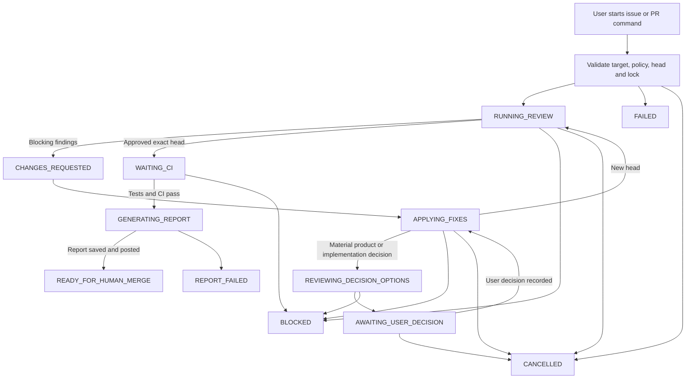

# Claude Code–Codex review loop: target experience

| Field | Value |
| --- | --- |
| Status | **In Review** |
| Parent roadmap | [#1](https://github.com/Mega-Gorilla/coding-review-agent-loop/issues/1) |
| Alignment issue | [#2](https://github.com/Mega-Gorilla/coding-review-agent-loop/issues/2) |
| Owner | Mega-Gorilla |
| Last updated | 2026-08-17 |
| Scope | Windows PowerShell 7、Linux/SSH上のPowerShell 7 |

## 1. この文書の目的

この文書は、Claude Codeをcoder、Codexをread-only reviewerとして利用し、PRの実装・修正・再レビューからユーザーのmerge判断までを支援するloopの完成イメージを定義する。

実装詳細を決める前に、ユーザーから見た操作、表示、停止条件、復旧、最終成果物を合意するためのゴールドキュメントとして使用する。

この文書が`Draft`または`In Review`の間、`Proposed`と`Open`は確定仕様ではない。Issue #2で合意した内容だけを`Decided`へ変更する。

## 2. 用語と合意状態

| Label | Meaning |
| --- | --- |
| `Decided` | ユーザーと合意済み |
| `Proposed` | 現時点の推奨案。レビューにより変更可能 |
| `Open` | ユーザー判断または技術検証が必要 |

主要な役割:

- **User**: 実行を開始し、必要な判断を行い、最後にmerge可否を決定する
- **Controller**: GitHub、worktree、agent、test、CI、state、logを調整する
- **Claude coder**: 実装・修正・test・commit・push・PR更新を行う
- **Codex reviewer**: 現在のPR headをread-onlyでレビューする
- **Codex final reporter**: 承認済みheadの変更と検証履歴をread-onlyで説明する

## 3. 完成状態の要約

### Decided

- ユーザーがIssue番号またはPR番号を指定して明示的に開始する
- PR自動検知、常駐watcher、webhook、label triggerは使用しない
- Windows PowerShell 7とLinux/SSH上のPowerShell 7を対象とする
- 既存の対話型Claude Code / Codex TUIへキー入力を注入しない
- controllerがClaude CodeとCodexの非対話CLIを起動する
- Codex reviewerとfinal reporterはread-onlyとする
- auto-merge、deploy、本番操作は行わない
- 最終状態はmerge完了ではなく`READY_FOR_HUMAN_MERGE`とする
- mergeはユーザーがGitHub上で手動実行する
- Issue modeでは、指定Issueのタイトル・本文・採用対象コメントを実装要件として使用する
- Issueに対応するPRが既に存在する場合は、重複作成せず既存PRからPR modeへ合流する
- 実装中に仕様上の判断が必要になった場合は変更を止め、Claudeの候補とCodexの独立意見を揃えてから、推奨案付きでユーザーへ判断を求める

### Proposed

- MVPは既存PRを対象とするPR modeから開始する
- Issue modeはPR modeの実運用確認後に追加する
- 通常時はController terminalだけで全体状況を理解できるようにする
- 詳細確認用にClaude logとCodex logを別tab / paneで表示できるようにする
- final reportは日本語で生成し、PRコメント、local artifact、terminal summaryへ出力する
- reviewとfixは最大3 roundを既定とする
- review承認後もCIがpendingなら`WAITING_CI`としてmerge可能扱いにしない

### Open

- MVPをPR modeだけに限定してよいか
- Issue modeを最初のreleaseへ含める必要があるか
- 正常時にagentごとのtabを自動で開くか、任意wrapperとするか
- SSH切断後も標準機能として継続させるか、`tmux`等の運用手順で対応するか
- final reportを常に日本語にするか、repository設定で言語を選択可能にするか
- CI待ちをcontrollerがforegroundで継続するか、一度終了してユーザーがresumeするか
- ユーザーへのclarificationをterminal入力だけで行うか、GitHub commentも使用するか
- local artifactの既定保存期間とcleanup方法

## 4. 完了の定義

ユーザーがコマンドを開始した後、次を満たした状態を完成とする。

1. Codexが現在のPR headをread-onlyでレビューしている
2. blocking findingがClaude Codeへ構造化して渡されている
3. Claude Codeの修正、test、commit、push後に新しいheadが再レビューされている
4. 全reviewerが同一head・同一roundで承認している
5. 承認された正確なheadでfinal testと必要なGitHub CIが成功している
6. Codex final reporterが変更、test、review履歴、残存riskを説明している
7. PRコメントとlocal artifactがapproved head SHAに結び付いている
8. controllerが`READY_FOR_HUMAN_MERGE`で停止している
9. ユーザーが十分な情報をもとにmerge可否を判断できる

merge自体は完成条件に含めない。

## 5. MVP利用シナリオ

### 5.1 PR mode: 正常系

**Status: Proposed**

前提:

- ユーザーまたはClaude CodeがすでにPRを作成している
- 対象repository、`gh`、Claude Code、Codexの認証が完了している
- coder用とreviewer用のworktreeを準備できる

ユーザー操作:

```powershell
claude-codex-dev-loop pr 512 --repo OWNER/REPO
```

期待する処理:

1. Controllerがrepository、PR、author、base/head、mergeability、lockを確認する
2. Codex reviewer用checkoutを現在のPR headへ同期する
3. Codexがread-onlyでreviewし、JSON Schemaに従うfindingを返す
4. findingがなければreview承認へ進む
5. blocking findingがあればClaude coder用checkoutを現在headへ同期する
6. Claude Codeがfindingを評価し、必要な修正とtestを行う
7. Claude Codeがcommit・pushし、controllerが新head SHAを確認する
8. Codexは新headに対してfresh sessionで再レビューする
9. 最大roundまたは停止条件まで3～8を反復する
10. 承認されたheadでfinal local testとGitHub CIを確認する
11. Codex final reporterがread-onlyで最終レポートを生成する
12. ControllerがartifactとPRコメントを保存・投稿する
13. Terminalへ`READY_FOR_HUMAN_MERGE`、PR URL、approved head、確認事項を表示する
14. ユーザーがGitHub上で内容を確認し、手動でmergeまたは差し戻す

### 5.2 Issue mode

**Behavior: Decided / Delivery phase: Proposed for a later phase**

```powershell
claude-codex-dev-loop issue 436 --repo OWNER/REPO
```

Issue modeでは、指定Issueのタイトル・本文・採用対象コメントを実装要件としてClaude Codeへ渡す。ここで指定する番号は実装対象のIssue番号であり、既存PR番号ではない。

PR modeとの差分:

1. ControllerがIssueのタイトル・本文・採用対象コメントを取得・filterする
2. Issueに対応する既存PRがあるか確認する
3. 既存PRがある場合は新しいPRを作らず、そのPRの現在headからPR modeへ合流する
4. 既存PRがない場合は、Claude Codeが実装、test、branch、commit、push、PR作成を行う
5. Controllerが作成されたPR URLとhead SHAを取得・保存する
6. 以降はPR modeと同じreview loopへ合流する

PR作成後にagent応答またはvalidationが失敗しても、Issue実装を最初からやり直さず、発見済みPRから再開できることを必須とする。

## 6. 期待するterminal experience

### 6.1 通常表示

**Status: Proposed**

```text
Claude–Codex Development Loop
Repository : OWNER/REPO
PR         : #512 Improve process lifecycle handling
Base       : main @ 0123456
Head       : feature/process @ abcdef0
Round      : 2 / 3
State      : RUNNING_REVIEW

[12:10:03] PR and trust policy validated
[12:10:04] Codex reviewer started in read-only mode
[12:13:20] Review completed: 2 blocking findings
[12:13:21] Claude coder started
[12:19:48] Tests passed: 128 passed
[12:20:12] Pushed new head: fedcba9
[12:20:14] Starting fresh review for fedcba9

Claude log : .agent-loop-logs/<run-id>-claude.log
Codex log  : .agent-loop-logs/<run-id>-codex.log
```

Controller terminalは、agentの思考全文ではなく、ユーザーが判断に必要なstate、round、SHA、test、CI、次の処理を表示する。

### 6.2 監視pane

**Status: Proposed**

Windows Terminalでは任意wrapperにより次の3 paneを開ける。

```text
+----------------------+----------------------+
| Controller           | Claude log           |
| state / round / SHA  | implementation log   |
| test / CI / action   | test / commit / push |
+----------------------+----------------------+
| Codex log                                   |
| review progress / structured output         |
+---------------------------------------------+
```

Linux/SSHでは同じ役割を`pwsh`と、必要に応じて`tmux` paneで提供する。paneは観測用であり、実行中agent TUIへの入力先にはしない。

### 6.3 正常終了表示

**Status: Proposed**

```text
READY_FOR_HUMAN_MERGE

PR            : https://github.com/OWNER/REPO/pull/512
Approved head : fedcba9876543210
Review rounds : 2
Local tests   : PASS (128 passed)
GitHub CI     : PASS (test, lint)
Final report  : posted to PR and saved locally

Human checks before merge:
1. Confirm the approved head still matches fedcba9876543210
2. Review the remaining risks and follow-ups
3. Confirm deployment or migration notes

No merge was performed.
```

## 7. State model

### Decided states

| State | User meaning |
| --- | --- |
| `RUNNING_REVIEW` | Codexが現在headをreview中 |
| `CHANGES_REQUESTED` | blocking findingがあり、修正が必要 |
| `APPLYING_FIXES` | Claude Codeがfindingを評価・修正中 |
| `REVIEWING_DECISION_OPTIONS` | Claudeが提示した判断候補をCodexが独立に評価中 |
| `AWAITING_USER_DECISION` | 候補、両agentの意見、推奨案を提示済みでユーザー判断待ち |
| `WAITING_CI` | review承認済みだが対象headのCI待ち |
| `GENERATING_REPORT` | final reporter実行中 |
| `READY_FOR_HUMAN_MERGE` | test・CI・reportが揃い、ユーザー判断待ち |
| `BLOCKED` | 自動継続できないfinding、no-progress、外部依存待ち |
| `FAILED` | auth、network、schema、agent、GitHub操作等の失敗 |
| `CANCELLED` | ユーザーによる中断 |
| `REPORT_FAILED` | review承認は保持されているがreport生成に失敗 |



## 8. User intervention

### Proposed intervention policy

| Situation | Automatic behavior | User receives | Resume |
| --- | --- | --- | --- |
| Codex finds blockers | Claudeへ渡して自動継続 | round summary | 不要 |
| Same finding remains | bounded retry後に停止 | unresolved findingとevidence | 同じPRから再開 |
| Max rounds reached | `BLOCKED` | 全未解決findingと推奨対応 | max rounds変更または手動修正後に再開 |
| Claude requests a material decision | `REVIEWING_DECISION_OPTIONS`へ移行し、Codexの独立意見を取得後に`AWAITING_USER_DECISION`で停止 | 判断理由、候補、影響、Claude / Codexの意見、推奨案 | ユーザーの決定を記録してClaudeへ渡し、同じPRから再開 |
| Permission required | bypassしない | 必要な操作と理由 | ユーザー承認後に再開 |
| Quota exhausted | retry loopを止める | agent、reset情報、保存済みstate | quota回復後に再開 |
| Authentication failure | `FAILED` | 対象CLIと再認証手順 | 認証後に再開 |
| Network/GitHub transient failure | bounded retry | retry回数と最終error | 安全なcheckpointから再開 |
| CI pending | `WAITING_CI` | check名、URL、head SHA | CI完了後に継続 |
| CI fails | 原因を分類 | failing checkとlog URL | code failureはClaude、infra failureは待機 |
| External head update | stopまたはreconcile | old/new SHAと無効化対象 | 新headでfresh review |
| Ctrl+C | 子process treeを停止 | last checkpointとresume command | 同じPRから再開 |
| Reporter fails | `REPORT_FAILED` | review承認とreport error | reporterだけ再実行 |

### Decided: 実装中のユーザー判断フロー

要件だけでは実装方針を一意に決められず、選択によってユーザー体験、互換性、security、運用、scopeのいずれかが実質的に変わる場合は、agentが推測で決定しない。単純な内部実装の詳細や、安全かつ容易に戻せる選択まで毎回問い合わせる必要はない。

1. Claude Codeは変更を止め、判断が必要な理由、制約、候補、各候補の利点・欠点・影響、自身の推奨案を構造化して返す。
2. Controllerはsource変更、commit、pushを進めず、stateを`REVIEWING_DECISION_OPTIONS`にする。
3. Codexはread-onlyでIssue、PR、現在のdiff、Claudeの候補を確認し、候補の不足、risk、要件との整合性、独立した推奨案を返す。
4. Controllerは両agentの見解を出典付きで統合し、平易な説明、選択肢、推奨案とその理由をユーザーへ提示して`AWAITING_USER_DECISION`で停止する。両agentの意見が異なる場合は、相違を隠さず並べて示す。
5. ユーザーが候補を選択するか別案を指示したら、Controllerは回答をdecision ledgerへ記録し、その決定を改変せずClaudeへ渡して実装を再開する。
6. 次のCodex reviewでは、通常のcode reviewに加えて、実装が記録されたユーザー決定へ適合していることを確認する。

ユーザーへ提示するdecision briefは最低限、次を含む。

| Item | Content |
| --- | --- |
| Decision ID | 再開後も同じ判断を追跡できる一意なID |
| 判断が必要な内容 | 何を決める必要があり、なぜ今は自動決定できないか |
| 制約と影響範囲 | 要件、互換性、security、運用、変更対象 |
| 候補 | 各案の内容、利点、欠点、risk、見送った場合の影響 |
| Claudeの意見 | coderとしての推奨案と根拠 |
| Codexの意見 | reviewerとしての独立評価、追加候補、推奨案と根拠 |
| システムの推奨表示 | 両者の根拠から推奨する候補。意見が割れた場合はその旨を表示 |
| 回答方法 | 番号付き候補を示し、推奨候補へ`Recommended`を付ける。自由記述も受け付ける |

表示例:

```text
AWAITING_USER_DECISION (decision-003)

判断が必要な内容: 設定ファイルがない場合の既定動作
影響: 既存利用者との互換性と初回実行時の安全性

[1] 現在の動作を維持する (Recommended)
    利点: 後方互換性を維持できる
    欠点: 初回設定の手間が残る
[2] 設定ファイルを自動生成する
    利点: 初回利用が簡単になる
    欠点: 意図しないfile書き込みが発生する

Claudeの意見: [2]。初回利用を簡単にできるため
Codexの意見: [1]。暗黙のfile書き込みを避けられるため
推奨: [1]。既存互換性と安全性を優先するため

1または2を選択するか、別案を入力してください。
```

ユーザー回答を待つ間は、同じ判断に関係するsource変更、commit、pushを行わない。安全なcheckpoint保存、status表示、cancelは許可する。

### Open intervention questions

- ユーザー判断の回答を同じterminalのstdinで受け取るか
- controllerを一度終了し、resume commandへ回答を渡す方式にするか
- GitHub commentによる非同期のユーザー判断を将来サポートするか
- permission承認をagent CLIへ直接渡すか、controller policy変更後にturnを再実行するか

## 9. Roles and permission boundary

### Decided

| Capability | User | Controller | Claude coder | Codex reviewer / reporter |
| --- | --- | --- | --- | --- |
| Start / cancel run | Yes | Handle | No | No |
| Read repository | Yes | Yes | Yes | Yes |
| Modify code | Optional | Coordination only | Yes | **No** |
| Run repository tests | Yes | Gate | Yes | Review only by default |
| Commit / push | Yes | Verify | Yes | **No** |
| Post GitHub comments | Yes | Yes | Through controller only | **No direct write** |
| Merge / deploy | **User only** | **No** | **No** | **No** |

Reviewerのread-onlyはプロンプト上の依頼ではなく、sandbox、profile、worktree、credential、network、MCP、hookの能力制限で保証する。

### Proposed safety behavior

- reviewerへpush可能なGitHub credentialを渡さない
- GitHub discussionはcontrollerが取得・filterしてreviewerへ渡す
- reviewer sessionをhead SHAへbindし、head変更時にfresh sessionにする
- `CLAUDE.md`、`AGENTS.md`、`.claude/**`、`.codex/**`、`.github/workflows/**`の変更を目立つ形で表示する
- fork PRまたは信頼されていないauthorでは、agent instructions、hooks、workflow、testの実行を既定拒否する
- prompt、log、artifact、PR commentからcredentialをredactする
- dangerous permission bypassとauto-mergeをpresetから利用できないようにする

## 10. Failure, cancellation, and resume experience

### 10.1 保存するcheckpoint

**Status: Proposed**

各重要stepで次を保存する。

- run ID、repository、Issue / PR番号
- base SHA、observed head SHA、approved head SHA
- state、round、agent role、session ID
- finding ledgerとresolution
- coder実行前後のHEAD、dirty status、push後head
- test command、cwd、result、duration
- GitHub check名、result、URL
- artifactとlogへのpath
- 最後に成功したGitHub mutationとidempotency marker
- error category、再開可能地点、推奨resume command
- 未解決decision request、Claude / Codexの意見、ユーザー回答、回答時のhead SHA

### 10.2 Cancel

**Status: Proposed**

- Ctrl+Cを1回受けたらgraceful cancellationを開始する
- 新しいagent processを起動しない
- 実行中の子process treeをOSごとの方法で停止する
- 最後のcheckpointを保存する
- `CANCELLED`、停止したprocess、resume commandを表示する
- 2回目のCtrl+Cは緊急強制停止として扱う案を技術検証する

### 10.3 Resume

**Status: Proposed**

ユーザーは同じPR commandを再実行するだけで、安全なcheckpointから再開できる。

```powershell
claude-codex-dev-loop pr 512 --repo OWNER/REPO
```

controllerはGitHub上の現在headと保存済みheadを比較し、古いagent sessionや承認を無条件に再利用しない。

## 11. Final report experience

### Proposed outputs

1. **PR comment**: ユーザーがGitHub上で読む正式なsummary
2. **Local JSON artifact**: schema検証済みのsource of truth
3. **Local Markdown artifact**: JSONから決定論的にrenderした全文
4. **Terminal summary**: merge判断に必要な短い結果とlink

### Proposed report language

- 既定は日本語
- file path、command、state、SHA、固有名詞は原文を維持
- repository設定による言語切り替えはOpen question

### Proposed report example

```markdown
## READY_FOR_HUMAN_MERGE

### Summary

PR #512は、WindowsとLinuxでagent processを安全に停止できるplatform abstractionを追加します。既存のPOSIX動作を維持し、Windowsでは子process treeがtimeoutやCtrl+C後に残らないようにします。

### Why

従来のrunnerはPOSIXのprocess groupに依存し、Windowsネイティブでtimeoutとcancelを安全に処理できませんでした。

### User-visible changes

- PowerShell 7から同じCLIを実行できます
- Ctrl+C時にClaude / Codexの子processが停止します
- timeout時にresume可能な状態と原因を表示します

### Acceptance criteria

| Criterion | Result | Evidence |
| --- | --- | --- |
| Linux existing behavior | Pass | `pytest ...` |
| Windows child cleanup | Pass | Windows CI `process-tests` |
| Ctrl+C recovery | Pass | test and run log |

### Review history

- Round 1: Codex found that grandchildren survived forced timeout
- Commit `fedcba9`: Claude assigned the process tree to a Windows Job Object
- Round 2: Codex approved the exact head

### Validation

- Approved head: `fedcba9876543210`
- Local tests: 128 passed
- GitHub CI: `test` and `lint` passed

### Remaining risks and follow-ups

- Windows Store版PowerShellは未検証です
- SSH切断後の自動継続は今回の対象外です

### Before merge

1. PR headが`fedcba9876543210`のままであること
2. Windows runner結果を確認すること
3. Remaining risksを許容できること

No merge or deployment was performed.
```

## 12. Windows and Linux/SSH experience

### Decided common behavior

- ユーザーはPowerShell 7から同じpreset CLIを実行する
- state名、report schema、GitHub comment形式をOS間で共通化する
- controllerは対象repositoryと同じマシンで実行する
- timeout、cancel、resumeを両OSで提供する

### Proposed platform differences

| Area | Windows | Linux/SSH |
| --- | --- | --- |
| Shell | PowerShell 7 | PowerShell 7 (`pwsh`) |
| Monitoring | Windows Terminal tab / pane | shellまたは`tmux` pane |
| Process tree | Windows Job Object等 | POSIX process group |
| Temp paths | `%TEMP%`, `%LOCALAPPDATA%` | `/tmp`, XDG/cache directory |
| Long-running session | terminalを維持 | `tmux`等を運用手順として案内 |

### Open platform questions

- Linux/SSHで`tmux`を推奨に留めるか、support要件に含めるか
- Windows Terminal wrapperを標準installへ含めるか、examplesとして提供するか
- Windows Store版とMSI版PowerShellの両方を正式検証するか
- SSH切断耐性をMVPの受入条件に含めるか

## 13. MVP boundary

### Proposed MVP inclusions

- 手動起動のPR mode
- Claude coder / Codex reviewer固定preset
- reviewer read-only保証
- review -> fix -> re-review、最大round
- head SHA binding、coder snapshot、PR lock
- local test gate、GitHub CI確認
- Windows/Linux process abstraction
- cancel、timeout、resume
- final reporterと`READY_FOR_HUMAN_MERGE`
- PR comment、local artifact、terminal summary
- credential redactionと基本trust policy

### Proposed later phases

- Issue mode
- llm-custom-commands compatibility wrapper
- 複数reviewer
- distributed multi-host lock
- GitHub comment経由の非同期ユーザー判断
- notification integration
- advanced finding fingerprintとtrend分析

### Decided exclusions

- PR自動検知、watcher、webhook、label trigger
- 対話型agent TUIへのキー入力注入
- auto-merge
- deploy、本番操作
- Windowsから複数SSH先を中央制御するremote execution system

## 14. Open questions

Issue #2で次を順に確認する。

| ID | Question | Why it matters | Current recommendation |
| --- | --- | --- | --- |
| Q-001 | MVPはPR modeだけでよいか | 最初の実装範囲と復旧難易度を左右する | PR modeから開始 |
| Q-002 | Issue modeを最初のreleaseへ含めるか | PR作成前後のsalvageが追加で必要 | 後続phase |
| Q-003 | final reportの既定言語は日本語固定か | schema、template、設定項目へ影響 | 日本語既定、将来選択可能 |
| Q-004 | CI pending時にforegroundで待ち続けるか | terminal占有とresume UXへ影響 | bounded wait後に`WAITING_CI` |
| Q-005 | ユーザー判断の回答をどの経路で渡すか | terminal継続、resume、GitHub commentの実装方式へ影響 | terminalで停止しresume時に回答。decision briefの内容と処理順序はD-010で決定済み |
| Q-006 | SSH切断耐性をMVPへ含めるか | service化または`tmux`依存へ影響 | `tmux`運用を案内、MVP外 |
| Q-007 | Windows Terminal paneを自動で開くか | wrapperと環境依存が増える | 任意wrapper |
| Q-008 | artifactの保存期間はどの程度か | disk、機密情報、監査要件へ影響 | repo単位設定、既定30日を検討 |
| Q-009 | approved follow-upをどう表示するか | merge判断と追加Issue作成へ影響 | reportでsummary、Issue自動作成なし |
| Q-010 | Claude permission要求をどう扱うか | bypassせず自動化する境界を決める | 停止して明示的にユーザーへ提示 |

## 15. Decision log

| ID | Date | Decision | Status | Source |
| --- | --- | --- | --- | --- |
| D-001 | 2026-08-17 | 実行はユーザーがIssue / PR commandで開始する | Decided | Issue #1 discussion |
| D-002 | 2026-08-17 | PR自動検知、watcher、webhook、label triggerは対象外 | Decided | Issue #1 discussion |
| D-003 | 2026-08-17 | 対話型TUIへ入力せず、非対話CLIをcontrollerが起動する | Decided | Issue #1 roadmap |
| D-004 | 2026-08-17 | PowerShellからの操作・log監視を維持する | Decided | Issue #1 roadmap |
| D-005 | 2026-08-17 | auto-merge、deploy、本番操作は行わない | Decided | Issue #1 roadmap |
| D-006 | 2026-08-17 | 正常なterminal stateは`READY_FOR_HUMAN_MERGE` | Decided | Issue #1 roadmap |
| D-007 | 2026-08-17 | Issue #1を親roadmap、Issue #2を完成イメージ合意に使う | Decided | Issue #2 |
| D-008 | 2026-08-17 | 既存docsは初回整理で移動せず、indexで分類する | Decided | Issue #2 preparation |
| D-009 | 2026-08-17 | Issue modeは指定Issueの内容を実装要件とし、対応PRが既にあれば重複作成せず再利用する | Decided | PR #3 discussion |
| D-010 | 2026-08-17 | 実装中の重要判断では、Claudeの候補をCodexが独立評価し、推奨付きdecision briefを提示してユーザー決定後に再開する | Decided | PR #3 discussion |

## 16. Agreement checklist

- [ ] Section 3の完成状態を確認した
- [ ] PR modeの正常系シナリオを確認した
- [ ] terminal表示と監視paneを確認した
- [ ] state modelを確認した
- [ ] user interventionとresume UXを確認した
- [ ] 実装中のユーザー判断フローとdecision briefを確認した
- [ ] roleとpermission boundaryを確認した
- [ ] final reportの形式とサンプルを確認した
- [ ] Windows / Linux SSHの差異を確認した
- [ ] MVP inclusions、later phases、exclusionsを確認した
- [ ] Q-001～Q-010を解決または判断時期付きで保留した
- [ ] 文書statusを`Agreed`へ変更した
- [ ] implementation plan作成へ進むことをIssue #2で確認した

## 17. Agreement後のnext action

1. `docs/plans/implementation-plan.md`を作成する
2. agreed target experienceをtechnical componentとdependencyへ分解する
3. Windows process、safe PR preset、final reporter等の実装Issueを発行する
4. Issue #1からtarget experience、implementation plan、子Issueを参照する
5. dependency順に小さなPRで実装する
